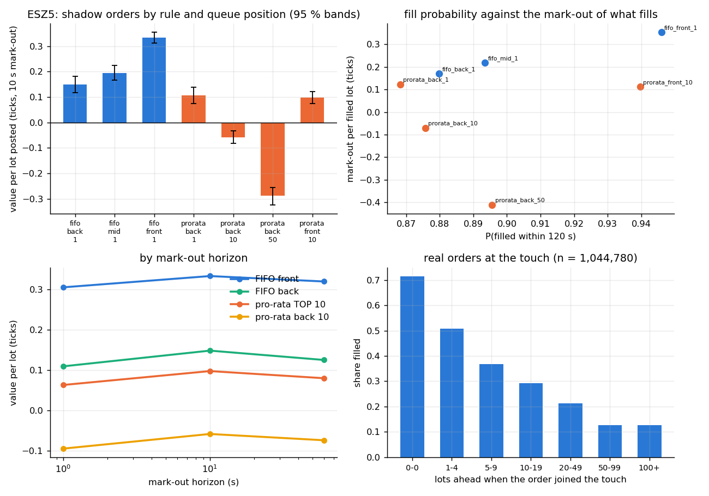
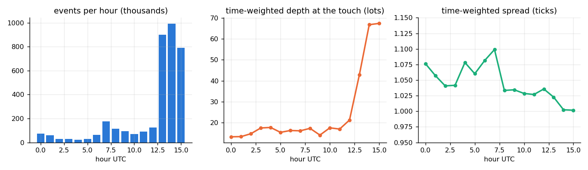
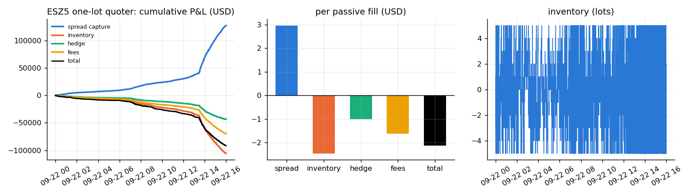
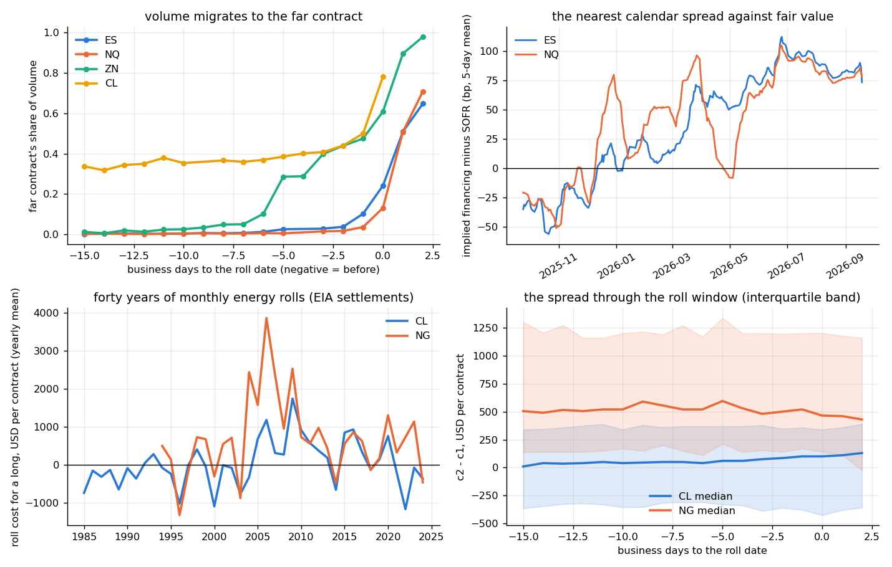
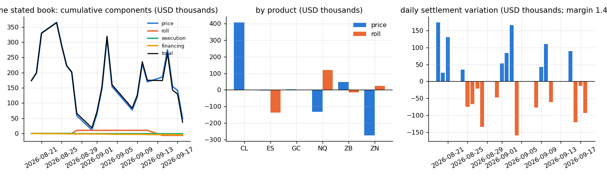
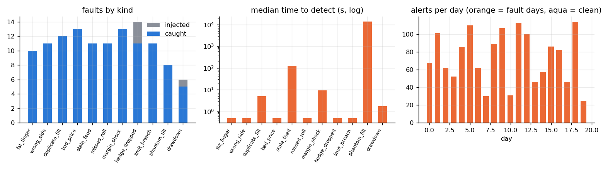
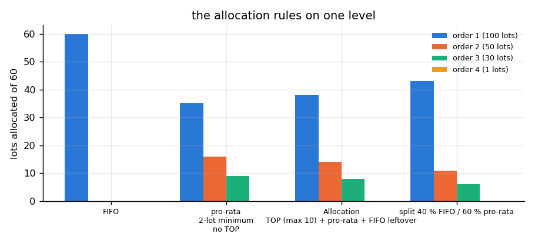

# futures-desk-analytics — Globex matching, queue value on recorded depth, rolls, P&L attribution and a positions monitor for a CME futures desk

**Question.** A futures desk on CME lives on four mechanics: the exchange's matching rules (price-time for the index, Treasury and energy outrights, pro-rata with a TOP order for SOFR), the queue position of every passive order, the roll of every position it carries, and a P&L that only makes sense once daily settlement variation, the roll, fees and the financing of margin are separated. What is a place in the queue worth under each matching rule, measured on recorded order-by-order depth rather than assumed? How do implied orders move an outright book? What does a roll cost per contract, and how does the spread behave in the roll window? How does a stated futures book's P&L decompose? And how fast does a positions-and-limits monitor catch what goes wrong?

**Answer (§Results).** On one Globex session of the E-mini S&P 500 (ESZ5, 22 Sep 2025, 3.67 M order-by-order events, the book rebuilt and checked level by level against the exchange's own MBP-10 feed to 67 differences in 147 M fields):
- *Queue value.* Under FIFO the front of the queue is worth **0.185 ticks per lot [0.164, 0.206] more than the back** ($2.31 [2.05, 2.57] on ES; 10 s mark-out, 95 % block-bootstrap band over 402,780 shadow orders): a lot at the front fills 95 % of the time within two minutes at a median 3.4 s and captures 0.50 ticks of half-spread; at the back 88 %, 9.3 s and 0.31 ticks — the difference is adverse selection, not fill rate. Overnight the number is 0.21 [0.19, 0.23]; in the cash session, with 67 lots at the touch, 0.06 [−0.01, 0.11]. Under pro-rata with TOP (the SOFR rule, replayed as a counterfactual on the same flow) TOP is worth 0.156 [0.145, 0.167] over the pool, and size is punished: the marginal lots of a 50-lot order lose 0.39 ticks per lot against a one-lot order because they fill when the level is swept. Of the 1.04 M real orders that joined the touch, 71 % filled when nothing was ahead of them and 13 % with 100+ lots ahead.
- *Rolls.* The September 2026 ES roll cost a long $3,388 per contract (67.75 points, the spread's implied financing 91 bp over SOFR net of dividends) with the volume crossing to December the day before the roll date; NQ $5,945 (86 bp over); the Treasury rolls were paid to the long (ZN −$250, ZB −$500); WTI −$4,220 in backwardation. Over the year the nearest ES calendar spread traded **51 bp [43, 58] over SOFR**. Forty years of EIA settlements put the monthly WTI roll at +$38 [−48, 124] per contract for a long (mean absolute $595, 57 % of months in contango) and Henry Hub at +$726 [519, 942], with the gas spread drifting $205 [81, 340] against the long over the ten days before the roll.
- *Attribution.* A stated six-product book ($48 m notional, $1.45 m SPAN-style margin) over 22 settlement days: +$48.7 k price, −$6.6 k roll (four rolls), −$1.1 k execution, −$4.6 k margin financing = +$36.5 k, with variation = price + roll to the cent; financing is 0.26 % of gross daily variation. A passive one-lot quoter replayed on the tape captures $2.97 per fill of spread and gives back $2.46 to inventory, $1.01 to hedging and $1.62 to fees: **−$2.13 per fill** over 42,946 fills — the queue-position number above is the size of the whole edge.
- *Monitor.* Thirteen rules, eleven fault kinds on twenty simulated fault days: 116 of 120 caught (97 %), median time to detect 0 s (at the event), 0.0 alerts per clean day; the fault the monitor cannot see (a phantom fill) is found by the end-of-day reconciliation.

Data checked 19 September 2026. Python package `futdesk` with a C++ replay (pybind11) and DuckDB/parquet storage; 32 tests; CI builds the extension and runs the whole pipeline on a committed 15-minute sample of the tape.

---

## Layout

```
cpp/replay.cpp         the compiled replay: the book from every MBO event; shadow orders (FIFO and pro-rata counterfactuals); the outcome
                       of every real order at the touch; a passive one-lot market maker with a hedge rule; one pass over the tape
futdesk/book.py        the Python reference book (same rules; tests check it agrees with the C++ event for event)
futdesk/matching.py    the matching engine: FIFO, the Allocation algorithm (TOP + pro-rata with a minimum + FIFO leftover), the configurable
                       FIFO/pro-rata split, implied in / implied out between two outrights and their calendar spread
futdesk/queue.py       the queue study: shadow insertion, mark-outs, block bootstrap, real-order outcomes, book statistics
futdesk/calendars.py   CME business days; last trading day, first notice and roll date rules per product (ES/NQ, CBOT Treasuries, SR3, ZQ, CL, NG, GC)
futdesk/roll.py        calendar spreads from settlements, implied financing against SOFR and dividends, roll windows and volume
                       migration, roll events, forty years of EIA energy rolls
futdesk/pnl.py         the daily attribution of the stated book (price / roll / execution / financing, core / hedge) and the intraday
                       attribution of the quoter (spread capture / inventory / hedge / fees), both reconciled
futdesk/margin.py      SPAN-style margin: scan risk, calendar-spread charge, inter-commodity credits
futdesk/monitor.py     the positions-and-limits monitor (13 rules), the fault catalogue (11 kinds), the simulated day, the scorer
futdesk/data.py        paths, DuckDB store, Databento CSV/DBN -> parquet, settlement / EIA / SOFR / dividend loaders
futdesk/run.py, cli    the pipeline and the command line: python -m futdesk run|queue|roll|book|monitor|match|tapes|sql
tools/download.py      Databento public sample (no key) and the paid API (DATABENTO_API_KEY); Yahoo per-contract closes; EIA; NY Fed
tools/make_sample.py   the CI sample: a window of the tape with a synthetic snapshot, and the MBP-10 rows for the validation test
configs/products.json  ticks, multipliers, months, date rules, matching algorithm, fees, margins, SPAN parameters (inputs, not results)
configs/book.json      the stated book;  configs/databento.json  the paid MBO days (rates, energy, SOFR) fetched when a key is present
tests/                 32 tests;  scripts/  run_all.sh, plots.py, summarize.py, report.py, make_notebook.py;  build.ps1 (MSVC)
data/reference/        settlements.parquet (accumulating archive), EIA, SOFR/EFFR, SPY/QQQ dividends;  data/sample/  the CI tape
results/               run.json, summary.md, figures/;  report.pdf;  notebooks/results.ipynb
```

Install: `pip install -e .[test]`; `python build_ext.py build_ext --inplace` (or `build.ps1` on Windows); `python -m pytest`; `scripts/run_all.sh` (download → build → run → figures → summary → report → notebook → tests; the run is a minute on the full session). `FUTDESK_DATA=data/sample` points everything at the committed sample.

---

## Data — what is real and what is simulated

| layer | source | span | real / simulated |
|---|---|---|---|
| order-by-order depth (MBO) and MBP-10 | Databento's public CME Globex MDP 3.0 sample, no key: ESZ5, 22 Sep 2025 00:00–16:00 UTC (19:00 CT Sunday to 11:00 CT Monday), 3,667,804 MBO events, 2.8 M MBP-10 rows | one Globex session | **real** — every order id, add, modify, cancel, fill and trade summary |
| more sessions and other products | the paid API (`DATABENTO_API_KEY`, the sign-up credit covers a few sessions): `configs/databento.json` asks for ZN, CL and SR3 on the same date | — | the loader and the whole study run unchanged on DBN files; **no rates or energy tape is in this repository yet**, so the queue numbers are ES only |
| daily closes per listed contract | Yahoo chart API (`ESZ26.CME`, `ZNZ26.CBT`, `CLX26.NYM`, …), 2y range, every contract listed today: 135 contracts, 55,217 rows | Sep 2024 – Sep 2026 | real closes (Yahoo's last price, not the official settlement); an expired contract disappears from Yahoo within weeks, so the file is an accumulating archive committed with each download |
| NYMEX contracts 1–4 | EIA daily spot and futures tables (RCLC1d…, RNGC1d…) | 1983 – Apr 2024 (EIA stopped the series) | real settlements |
| SOFR, EFFR | NY Fed | 2018 – | real |
| SPY / QQQ dividends and closes | Yahoo | 2021 – | real; the trailing twelve-month yield is the dividend input |
| the shadow orders, the pro-rata counterfactual, the quoter | this repository, replayed on the real tape | — | **simulated on the recorded flow**: they assume our order would not have changed anyone else's behaviour |
| the monitor's days | this repository: marks from the recorded ES mid path for the index legs, settlement-calibrated random walks for the others, ordinary fills, planted faults | 40 days | **simulated** |
| fees, margins, SPAN parameters | `configs/products.json`, approximate public values | — | inputs to be replaced by the desk's schedule |

---

## Method

**The book.** Prices are integers in ticks. `A` adds an order at the back of its level, `C` deletes it, `M` keeps priority on a size decrease and loses it (to the back) on a price change or size increase, `F` fills a resting order (a fully filled order is then deleted), `T` is the aggressor's summary and changes nothing, `R` clears. Each level is an insertion-ordered map, so queue position is exact. The validation compares all ten levels (price, size, order count, both sides) with Databento's MBP-10 at every packet end: 67 of 147,275,160 fields differ on the session, 0 of 6.2 M on the sample. The Python and C++ books agree event for event.

**Queue value.** Every second a shadow order is inserted at the touch (sides alternate) in each variant: FIFO at the front (priority ahead of every resting order), the middle (behind half the resting volume) or the back, one lot; pro-rata at the back with 1, 10 or 50 lots and as TOP with 10. It is carried through the recorded events. Under FIFO its volume ahead $a$ falls with every cancel, size reduction and fill of an order ahead of it; a fill of an order *behind* it means the tape's volume would have reached it first, so it fills; a fill at a better price on its side (the aggressor swept past its level) fills it outright; it expires at $H = 120$ s. Under pro-rata (the Allocation algorithm: the TOP order first, then $\lfloor V s_i / S \rfloor$ per order with allocations below two lots dropped, then the leftover FIFO) the trade summary's size $V$ is allocated over the pre-trade level with the shadow inside it. Value per lot posted at mark-out $\tau$:

$$v_\tau \;=\; \frac{\sum_{\text{fills}} q_f \cdot \text{side}_f\,(m_{t_f+\tau} - p_f)}{\sum_{\text{shadows}} s}\,,\qquad \text{queue value} \;=\; v_\tau^{\text{front}} - v_\tau^{\text{back}}$$

in ticks, unfilled lots counting zero — the definition of positional value in Moallemi & Yuan (the static trade-off between the half-spread earned and the adverse selection that rises with queue position). Bands are a block bootstrap over five-minute blocks of insertion time (1,000 draws). The same pass records every real order added at the touch: volume ahead at entry, whether its first outcome was a fill or a cancel, its life and its mark-out.

**Matching engine** (`matching.py`). Price-time; the Allocation algorithm with TOP (the first order to better the market, one per side, matched first up to a maximum), pro-rata with a minimum allocation, a FIFO leftover pass; the configurable split (a FIFO share before the pool). Implied orders, first generation only and behind the real orders at a price level: with the spread quoted as $S = L_1 - L_2$,

$$\text{implied out: } S^{b} = L_1^{b} - L_2^{a},\; S^{a} = L_1^{a} - L_2^{b};\qquad \text{implied in: } L_1^{b} = S^{b} + L_2^{b},\; L_1^{a} = S^{a} + L_2^{a},\; L_2^{b} = L_1^{b} - S^{a},\; L_2^{a} = L_1^{a} - S^{b},$$

quantities the minimum of the two components; a fill against an implied order executes both component orders. Known-answer tests cover each rule (100/50/30/1 lots resting, 60 incoming: FIFO 60/0/0/0; pro-rata 35/16/9/0; Allocation with TOP capped at 10: 38/14/8/0; 40/60 split: 43/11/6/0) and a random conservation test.

**Rolls.** For consecutive listed contracts the spread $F_2 - F_1$ on every date; for the index products the implied financing $r = q + (F_2/F_1 - 1)\,365/\Delta t$ with $q$ the ETF's trailing dividend yield, richness $= r - \text{SOFR}$ (overnight SOFR stands in for the term rate over the spread's tenor). The roll date is five business days before expiry for cash-settled contracts and two before the earlier of first notice and last trading day for physically delivered ones (`calendars.py` carries the rulebook dates; tests check them against the exchange's published ones). Roll cost for a long per contract $= (F_2 - F_1)\,m + \tfrac12\,\text{spread tick}\cdot m + 2\,\text{fee}$. From EIA's contracts 1–4 the same on every monthly energy roll since 1985.

**Attribution.** The held contract switches at the roll date's settlement, so on the day after a roll the settlement variation on the new contract splits exactly:

$$\underbrace{q\,m\,[F_t(c_t) - F_{t-1}(c_t)]}_{\text{variation}} \;=\; \underbrace{q\,m\,[F_t(c_t) - F_{t-1}(c_{t-1})]}_{\text{price}} \;-\; \underbrace{q\,m\,[F_{t-1}(c_t) - F_{t-1}(c_{t-1})]}_{\text{roll: the spread paid}}$$

with execution at each roll and the financing of the SPAN-style initial margin at SOFR (scan risk per product = the exchange's outright margin times the net position, a calendar-spread charge for offsetting months, inter-commodity credits for the listed pairs), total = variation + execution + financing. The quoter: one lot each side at the touch joined at the back, re-quoted when the touch moves, inventory flattened at the opposite touch when it reaches ±5; spread capture $= \sum \text{side}\,q\,(m_t - p)$ over passive fills, hedge the same over the crossings, inventory $= \sum \text{inv}_k\,(m_{k+1} - m_k)$ between fills; cash + inventory at the closing mid = spread capture + inventory + hedge exactly (a test).

**Monitor.** Rules: position limit, gross notional, margin usage and the maintenance call, a physically delivered contract into its first-notice window, a contract past its last trading day, a roll not done, a stale mark, a fill or mark outside the price band, a fill above the clip limit, a duplicate fill id, a broken hedge ratio on a pair, an intraday drawdown, the end-of-day reconciliation of positions against the fills. Faults planted on alternate days: fat finger, wrong side, duplicate fill, bad price, stale feed, missed roll, margin shock, hedge dropped, limit breach, phantom fill, drawdown. A fault is caught when an alert of its rule for its product arrives within 15 minutes (the reconciliation faults, at the end of the day); clean days count false alerts.

---

## Results

### Queue value on the recorded tape



| rule | position | size | P(fill in 120 s) | median time to fill (s) | half-spread at fill (ticks) | mark-out per filled lot (ticks) | value per lot posted (ticks) | 95 % |
|---|---|---|---|---|---|---|---|---|
| FIFO | back | 1 | 0.880 | 9.3 | 0.313 | 0.169 | 0.149 | [0.118, 0.181] |
| FIFO | middle | 1 | 0.893 | 7.1 | 0.391 | 0.218 | 0.195 | [0.166, 0.225] |
| FIFO | front | 1 | 0.946 | 3.4 | 0.501 | 0.353 | 0.334 | [0.313, 0.355] |
| pro-rata | back | 1 | 0.868 | 9.7 | 0.278 | 0.123 | 0.107 | [0.074, 0.138] |
| pro-rata | back | 10 | 0.876 | 14.5 | 0.105 | −0.070 | −0.058 | [−0.082, −0.032] |
| pro-rata | back | 50 | 0.896 | 29.0 | −0.244 | −0.411 | −0.288 | [−0.323, −0.255] |
| pro-rata | TOP | 10 | 0.940 | 8.9 | 0.298 | 0.112 | 0.098 | [0.074, 0.122] |

Front minus back under FIFO: 0.185 ticks [0.164, 0.206] at 10 s, 0.196 at 1 s, 0.195 at 60 s — the number is not a mark-out artefact. Middle minus back 0.046 [0.039, 0.053]. The pro-rata pool pays a one-lot order almost what FIFO's back does (it can never receive an allocation below the two-lot minimum, so it lives on sweeps and leftovers) and charges size: a 50-lot order's lots fill 70 % of the time but at −0.24 ticks of half-spread — the level is being swept when they fill. The 1.04 M real orders posted at the touch: 27 % filled, 73 % cancelled, median life 0.17 s; the fill share falls from 71 % with nothing ahead to 13 % with 100+ lots ahead, and the mark-out of the fills halves from 0.04 ticks to 0.02 across the same buckets.



The session: spread 1.045 ticks time-weighted (one tick 95.5 % of the time), 24 lots at the touch overnight rising to 67 in the cash session, 1.43 M orders added and 1.42 M cancelled for 154 k trades of 3.2 lots (p99 28).

### The passive quoter, and what the queue is worth to it



| component | USD over the session | per passive fill |
|---|---|---|
| spread capture | 127,369 | 2.97 |
| inventory | −105,694 | −2.46 |
| hedge | −43,500 | −1.01 |
| fees | −69,710 | −1.62 |
| total | −91,535 | −2.13 |

A quoter with no signal that joins the back of the queue loses $2.13 a fill on ES; the front of the queue is worth $2.31 a lot. Queue position is the market maker's edge in a one-tick market, which is why the desk cares about the matching rule.

### Rolls



| roll | date | spread | USD per contract for a long | drift over the prior 10 bd | volume crossover | implied financing − SOFR |
|---|---|---|---|---|---|---|
| ESU6 → ESZ6 | 2026-09-11 | 67.75 | 3,388 | −12 | 1 bd before | 91 bp |
| NQU6 → NQZ6 | 2026-09-11 | 297.25 | 5,945 | +25 | 1 bd before | 86 bp |
| ZNU6 → ZNZ6 | 2026-08-27 | −0.25 (8/32) | −250 | +16 | on the day | — |
| ZBU6 → ZBZ6 | 2026-08-27 | −0.50 | −500 | 0 | on the day | — |
| ZTU6 → ZTZ6 | 2026-08-27 | −0.137 | −273 | −47 | on the day | — |
| CLV6 → CLX6 | 2026-09-18 | −4.22 | −4,220 | −1,310 | on the day | — |

Over the last year the nearest ES calendar spread implied financing of 51 bp [43, 58] over SOFR (NQ 39 [33, 46]), between −25 and +130 bp on the 10th–90th percentile days — the roll is where the equity desk's funding cost shows. EIA's history (471 WTI rolls since 1985, 363 gas rolls since 1994): WTI +$38 [−48, 124] per contract per month with a mean absolute of $595; gas +$726 [519, 942], 80 % of months in contango, the spread moving $205 [81, 340] against the long over the ten days before the roll. Execution adds $2.50 + two fees on ES, $5 on CL.

### The stated book



+40 ES / −20 NQ (equity pair), +100 ZN / −30 ZB (curve pair), +25 CL, +10 GC; $48 m notional; $1.45 m SPAN-style initial margin after $461 k of inter-commodity credits. 19 Aug – 18 Sep 2026 (the window in which every held contract has a settlement in the archive; it lengthens with each download): price +$48.7 k, roll −$6.6 k (ES −$135.5 k, NQ +$118.9 k, ZN +$25.0 k, ZB −$15.0 k), execution −$1.1 k, financing −$4.6 k, total +$36.5 k; core +$22.0 k, hedge +$20.2 k; daily variation sd $97 k, worst day −$159 k.

### The monitor



| fault | injected | caught | median time to detect | rule |
|---|---|---|---|---|
| fat finger | 10 | 10 | at the fill | FAT_FINGER |
| wrong side | 11 | 11 | at the fill | POSITION_JUMP |
| duplicate fill | 12 | 12 | 5 s | DUPLICATE_FILL |
| bad price | 13 | 13 | at the fill | PRICE_BAND |
| stale feed | 11 | 11 | 129 s | STALE_MARK |
| missed roll | 11 | 11 | first check | DELIVERY_RISK, EXPIRY_RISK |
| margin shock | 13 | 13 | 9 s | MARGIN_CALL |
| hedge dropped | 14 | 11 | at the fill | PAIR_BROKEN |
| limit breach | 11 | 11 | at the fill | POSITION_LIMIT |
| phantom fill | 8 | 8 | end of day | RECON_BREAK |
| drawdown | 6 | 5 | 2 s | PNL_DRAWDOWN |

116 of 120; 0.0 alerts per clean day. The three hedge-dropped misses fell inside the 15-minute cooldown of a pair alert an earlier fault on the same pair had raised; the drawdown miss was a shock too small for the limit.

### The matching rules on one level



---

## Validation

- Book: Python and C++ replay identical on 150 k events; both against the exchange's MBP-10 at every packet — 0 mismatches on the sample, 67 in 147 M fields on the session.
- Shadow orders: hand-worked tapes for the front and back of the queue, a sweep through the level, expiry, the pro-rata allocation (3 of 60 to a 10-lot order behind 150, TOP first, a one-lot order below the minimum gets nothing).
- Matching: the four rules against hand-computed allocations; conservation on 300 random levels; TOP assignment and priority loss on modify; implied prices and the two-leg execution.
- Calendars: last trading and first notice days for eleven contracts against the exchange's published dates.
- Attribution: variation = price + roll on a synthetic settlement path with a roll; the quoter identity to 1e-9 on random fills; the margin credits.
- Monitor: a clean day is silent; every fault kind is caught on deterministic days; the rules fire directly.

## Caveats

- One session of one product. The rates and energy tapes need the paid Databento days (`configs/databento.json`); the code path is the same. The pro-rata numbers are a counterfactual on flow that was matched FIFO: the orders around the shadow would behave differently on a pro-rata market, and TOP status of real orders is not modelled.
- The shadow orders assume they change nothing else; the quoter's hedges assume the touch is there at the size.
- Yahoo closes are last prices, not settlements, and the archive only reaches back to what was listed at each download, so the roll-window study has one roll per product so far; the EIA history stops in April 2024.
- Implied financing uses overnight SOFR against a three-month forward tenor and the trailing dividend yield; a term rate and the dividend strip would move the level by tens of bp.
- Fees, margins, scan ranges and credits are approximate public values; the monitor's days are simulated.

## References

- Moallemi, C. and K. Yuan, [A Model for Queue Position Valuation in a Limit Order Book](https://moallemi.com/ciamac/papers/queue-value-2016.pdf) (2016) — the definition of positional value measured here.
- CME Group, [Supported Matching Algorithms](https://cmegroupclientsite.atlassian.net/wiki/spaces/EPICSANDBOX/pages/457218479/Supported+Matching+Algorithms) and Databento, [CME matching algorithms explained](https://databento.com/blog/cme-matching-algorithms-explained) — the rules implemented in `matching.py`.
- CME Group, [CME SPAN methodology](https://www.cmegroup.com/clearing/risk-management/span-overview.html) — the shape of the margin in `margin.py`.
- Data: [Databento](https://databento.com/datasets/GLBX.MDP3) CME Globex MDP 3.0 public sample; EIA petroleum and natural-gas spot/futures tables; NY Fed reference rates; Yahoo Finance chart API.

## CV bullet

- **Futures Desk Microstructure and Analytics** | Python, C++, DuckDB, SQL | `futures-desk-analytics` — Globex matching rules (FIFO, pro-rata with TOP, implied spreads) implemented and tested; the ES order book rebuilt from 3.7 M MBO events and checked against the exchange's MBP-10; queue position measured with 400 k shadow orders: the front of the FIFO queue is worth 0.19 ticks per lot [0.16, 0.21] over the back and pro-rata TOP 0.16, while a naive back-of-queue quoter loses $2.13 a fill; rolls costed per contract (ES +$3,388 at 91 bp over SOFR, forty years of energy rolls); a six-product book's P&L attributed to price, roll, execution and margin financing to the cent; a positions-and-limits monitor catching 116 of 120 injected faults with no false alerts.
